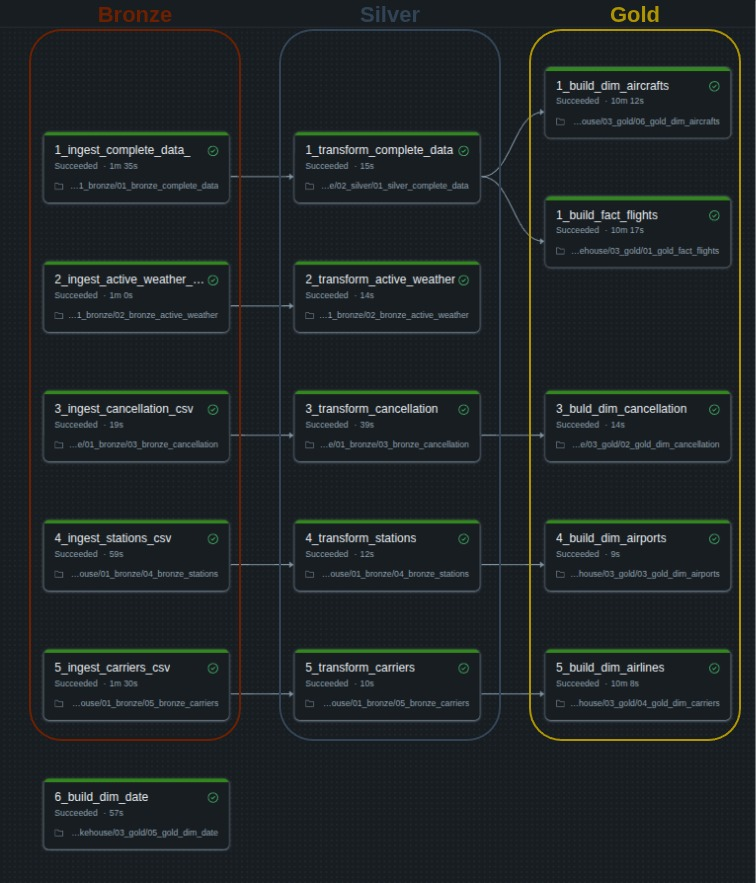

# 2022 Airlines Departure Data Lakehouse

A batch lakehouse built on 2022 US domestic airline departure data, implementing a Medallion architecture with Delta Lake and orchestrated with Lakeflow on Databricks.

## 📌 Overview

This project ingests the raw flight departure records from the landing zone and refines them to a clean, analytics-ready star schema. The final goal of this project is to support efficient querying, reporting, and analytics for airline departure operations and performance metrics.

Key Features:

* Real-world dataset with 7 million records.
* Dimensional database modelling (star schema).
* Medallion Architecture (Bronze->Silver->Gold)
* Incremental batch loading using merge to demonstrate upserts
* Orchestrated as scheduled Lakeflow jobs
- Delta Lake

## Data Source

The project is using [2022 US Airlines Domestic Departure dataset ](https://www.kaggle.com/datasets/jl8771/2022-us-airlines-domestic-departure-data).

The main CompleteData.csv file has been divided up to monthly datasets to simulate incremental data loading. Each monthly batch has been assigned to a batch_id (ex.: 2022-1) and I used this batch_id to orchestrate the pipeline. 

## 🧱 Architecture

### Bronze Layer

- Ingests the raw datasets into Delta tables, matched against an explicit schema.
- Adds batch_id, ingestion_timestamp, source_file columns for auditing and data lineage.
- No transformations applied to the data.
- The data is partitioned according to batches.

### Silver Layer

- Performs quality check through a custom written SparkQCheck class. 
- Cleans data (removes duplicates and drops columns with excessive missing values).
- Incremental data batch loading using MERGE.
- Renames columns for consistency and clarity.

### Gold Layer

- Star schema optimized for analytics.
- Fact table -> fact_flights: one row per flight for metrics and foreign keys to each dimensions.
- Dimension tables:
  - dim_aircrafts    -> Aircraft information separated from the main table.
  - dim_airlines     -> Airlines information dimension table.
  - dim_airports     -> Airports information dimension table.
  - dim_cancellation -> Cancellation information dimension table.
  - dim_date         -> A custom date dimension table for the year 2022 for analytics and advanced date-based aggregations.

## Lakeflow Orchestration

Each layer contains separate notebooks that orchestrate the loading. I am also utilizing the dbutils.widget module makes it possible to pass through the batch_id in every notebook that makes it possible to process every batch dynamically. 

- airlines_departures_etl                 -> Orchestrates the notebooks across the Medallion architecture.
- incremental_airlines_departure_pipeline -> Orchestrates the incremental batch loading process.

### Pipeline 1: airlines_departures_etl

Main pipeline responsible for processing the data from the Bronze layer through to the Gold layer.

### Pipeline 2: incremental_airlines_departure_pipeline

The pipeline notebooks do the following tasks:
- Identifies all the batches.
- Identifies the processed and unprocessed batches. 
- Schedules the next batch for processing.
- Records and updates the batch processing data in the pipeline_control Delta Lake table.
- Contains the first pipeline as a separate task.

## 🗃️ ERD Diagram
 

## 🧰 Tech Stack

- **Databricks Communnity Edition**
- **Pyspark**
- **Delta Lake**
- **SQL**

## 📁 Repository Structure

## 🔗 References

- Kaggle - 2022 US Airlines Domestic Departure Data
  https://www.kaggle.com/datasets/jl8771/2022-us-airlines-domestic-departure-data

✅ This project uses only publicly available data for educational purposes.
