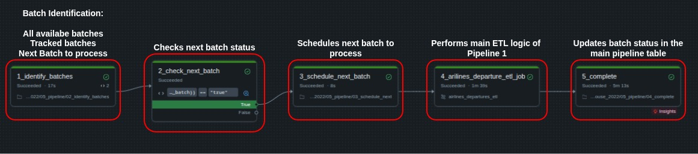
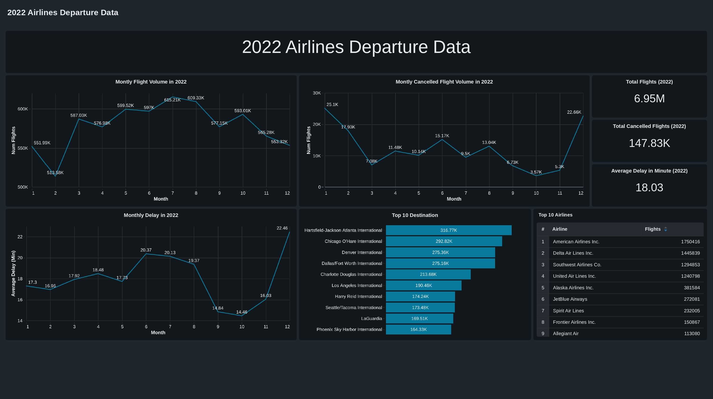
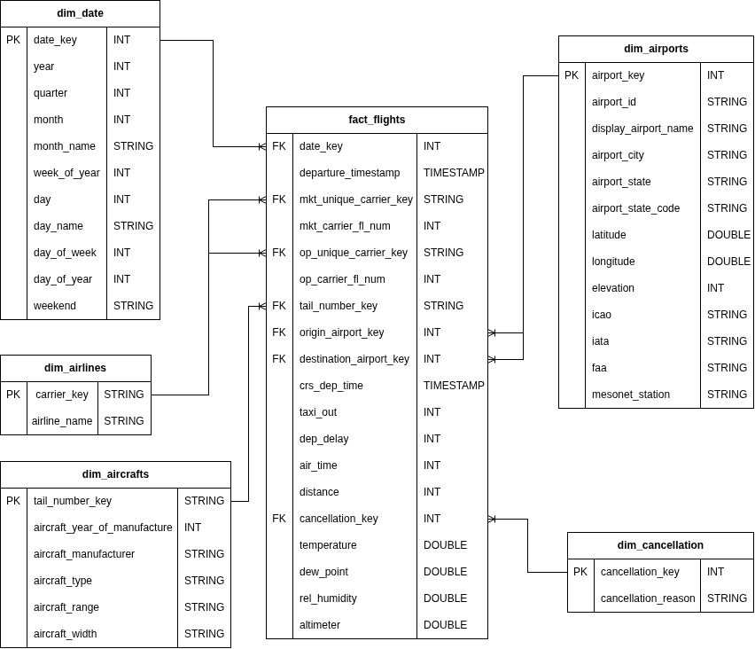

# 2022 Airlines Departure Data Lakehouse

A batch lakehouse built on 2022 US domestic airline departure data, implementing a Medallion architecture with Delta Lake and orchestrated with Lakeflow on Databricks.

## 📌 Overview

This project ingests the raw flight departure records from the landing zone and refines them to a clean, analytics-ready star schema. The final goal of this project is to support efficient querying, reporting, and analytics for airline departure operations and performance metrics.

Key Features:

* Real-world dataset with 7 million records.
* Dimensional database modelling (star schema).
* Medallion Architecture (Bronze->Silver->Gold)
* Incremental batch loading using merge to demonstrate upserts
* Orchestrated as scheduled Lakeflow jobs
- Delta Lake

## Data Source

The project is using [2022 US Airlines Domestic Departure dataset ](https://www.kaggle.com/datasets/jl8771/2022-us-airlines-domestic-departure-data).

The main CompleteData.csv file has been divided into monthly datasets to simulate incremental data loading. Each monthly batch has been assigned to a batch_id (ex.: 2022-1), and I used this batch_id to orchestrate the pipeline. 

## 🧱 Architecture

### Bronze Layer

- Ingests the raw datasets into Delta tables, matched against an explicit schema.
- Adds batch_id, ingestion_timestamp, source_file columns for auditing and data lineage.
- No transformations applied to the data.
- The data is partitioned according to batches.

### Silver Layer

- Performs quality check through a custom written SparkQCheck class. 
- Cleans data (removes duplicates and drops columns with excessive missing values).
- Incremental data batch loading using MERGE.
- Renames columns for consistency and clarity.

During a data quality check of the completed_data table, I found that all related weather data is missing. Since active_weather was designed to join these columns, the null values meant that the weather dimension had no relationship to the main data table. Therefore, the active_weather table was excluded at the silver layer rather than processed further into the gold layer.

### Gold Layer

- Star schema optimized for analytics.
- Fact table -> fact_flights: one row per flight for metrics and foreign keys to each dimensions.
- Dimension tables:
  - dim_aircrafts    -> Aircraft information separated from the main table.
  - dim_airlines     -> Airlines information dimension table.
  - dim_airports     -> Airports information dimension table.
  - dim_cancellation -> Cancellation information dimension table.
  - dim_date         -> A custom date dimension table for the year 2022 for analytics and advanced date-based aggregations.

## Lakeflow Orchestration

Each layer contains separate notebooks that orchestrate the loading. I am also utilizing the dbutils.widget module makes it possible to pass through the batch_id in every notebook that makes it possible to process every batch dynamically. 

- airlines_departures_etl                 -> Orchestrates the notebooks across the Medallion architecture.
- incremental_airlines_departure_pipeline -> Orchestrates the incremental batch loading process.

### Pipeline 1: airlines_departures_etl

Main pipeline responsible for processing the data from the Bronze layer through to the Gold layer.


### Pipeline 2: incremental_airlines_departure_pipeline

The pipeline notebooks do the following tasks:
- Identifies all the batches.
- Identifies the processed and unprocessed batches. 
- Schedules the next batch for processing.
- Records and updates the batch processing data in the pipeline_control Delta Lake table.
- Contains the first pipeline as a separate task.



## 📈 Analytics and Dashboard

A dedicated analytics [**analytics notebook**](/05_analytics/1_analytics.ipynb) with queries to support a Databricks SQL dashboard:
- **Summary Metrics** — total flights, average departure delay, total cancellations
- **Airport Performance** — monthly flight/cancellation/delay trends, busiest destination airports
- **Carrier Metrics** — flights per carrier, running totals of flights and delay per carrier by month
- **Aircraft Metrics** — top 10 busiest aircraft, fleet age classification (New / Mid-age / Older / Very Old, based on years since manufacture)



## 🗃️ ERD Diagram
 


## 🧰 Tech Stack

- **Databricks Communnity Edition**
- **Pyspark**
- **Delta Lake**
- **SQL**

## 📁 Repository Structure

```bash
├── 01_bronze
│   ├── 00_setup.ipynb
│   ├── 01_bronze_complete_data.ipynb
│   ├── 02_bronze_active_weather.ipynb
│   ├── 03_bronze_cancellation.ipynb
│   ├── 04_bronze_stations.ipynb
│   └── 05_bronze_carriers.ipynb
├── 02_silver
│   ├── 00_quality_check.ipynb
│   ├── 01_silver_complete_data.ipynb
│   ├── 02_silver_active_weather.ipynb
│   ├── 03_silver_cancellation.ipynb
│   ├── 04_silver_stations.ipynb
│   └── 05_silver_carriers.ipynb
├── 03_gold
│   ├── 01_gold_fact_flights.ipynb
│   ├── 02_gold_dim_cancellation.ipynb
│   ├── 03_gold_dim_airports.ipynb
│   ├── 04_gold_dim_carriers.ipynb
│   ├── 05_gold_dim_date.ipynb
│   ├── 06_gold_dim_aircrafts.ipynb
│   └── 07_gold_tables_optimization.ipynb
├── 04_pipeline_batch_scheduling
│   ├── 01_pipeline_table.ipynb
│   ├── 02_identify_batches.ipynb
│   ├── 03_schedule_next.ipynb
│   └── 04_complete.ipynb
├── 05_analytics
│   └── 1_analytics.ipynb
├── LICENSE
├── README.md
├── config
│   └── config.ipynb
├── docs
│   └── images
│       ├── dashboard.jpg
│       ├── erd.jpg
│       ├── pipeline_1.jpg
│       └── pipeline_2.jpg
└── src
    ├── quality_check.ipynb
    └── schema_definitions.ipynb

```


## 🔗 References

- Kaggle - 2022 US Airlines Domestic Departure Data
  https://www.kaggle.com/datasets/jl8771/2022-us-airlines-domestic-departure-data

- Apache Spark Documentation
  https://spark.apache.org/docs/latest/index.html

- Databricks Documentation
  https://docs.databricks.com/aws/en/

✅ This project uses only publicly available data for educational purposes.
